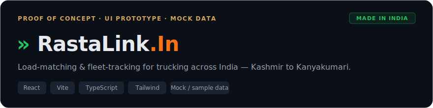

[](https://vishnu-vardhan-d.github.io/RastaLink-MVP/)

**Proof of concept · early-stage idea** — a UI prototype exploring a load-matching & fleet-tracking experience for trucking across India (Kashmir to Kanyakumari), built to learn *what users would actually want to see* before building the real platform.

### ▶ [View the live demo](https://vishnu-vardhan-d.github.io/RastaLink-MVP/)

> **Disclaimer:** This is a **proof-of-concept UI prototype only** — no backend, no database, no live data; everything on screen is **mock / sample data** used to explore requirements. It is **voluntary, unpaid, non-commercial** work — not a product, not for sale. A fuller, functional version is being explored privately.

## Why I built this

I built this on a volunteer basis for someone exploring an idea in India's road-freight space. Road freight across the country is enormous but fragmented — matching available trucks to available loads is still largely done over phone calls and informal networks, with little visibility into where trucks are, what rates are moving, or which loads are open. They wanted to see the *experience* made tangible before committing to a full build, so I put together this prototype: a single screen where dispatchers, fleet owners, and drivers could see live matching, fleet status, rates, and route conditions at a glance. Building the interface first is a fast, low-cost way to pressure-test the idea and learn which parts actually matter to the people who'd use it.

## Where it's headed

This prototype is the front end of a larger concept. The functional version being explored privately would replace the mock panels with real moving parts: a backend and data model, a load-matching engine, driver/fleet onboarding, and genuine real-time data feeds for tracking, rates, and conditions. The aim here is to validate the shape and the workflow with real feedback first, then build the working system behind it. It remains a personal, non-commercial project.

## What's in the demo

A dashboard-style preview, all on sample data, to show the *shape* of the product:

- A live-alerts ticker and key network stats
- Fleet status and live freight rates
- A load-matching view and an analytics panel
- An airport-board style weather & fuel display

## Tech

React · Vite · TypeScript · Tailwind CSS · deployed free on GitHub Pages

## Run locally

```bash
npm install
npm run dev      # http://localhost:5000
```

---
_Proof of concept · mock data only · voluntary, non-commercial, not for sale._
